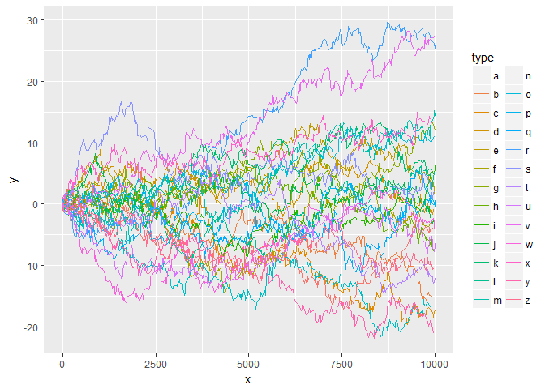
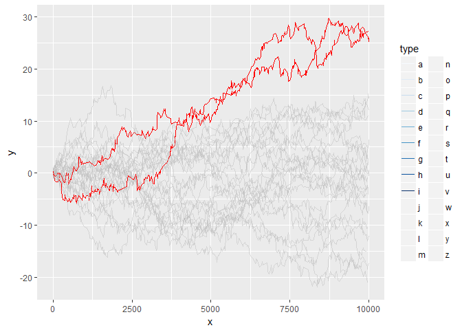

<!-- README.md is generated from README.Rmd. Please edit that file -->
gghighlight
===========

Highlight points and lines in ggplot2.

Installation
------------

You can install gghighlight from github with:

``` r
# install.packages("devtools")
devtools::install_github("yutannihilation/gghighlight")
```

Example
-------

Suppose the data has a lot of series.

``` r
library(tidyverse)

set.seed(1)
d <- tibble(
  x = 1:10000,
  y = runif(x, -1, 1),
  type = sample(letters, size = length(x), replace = TRUE)
) %>%
  group_by(type) %>%
  mutate(y = cumsum(y)) %>%
  ungroup()
```

It is difficult to distinguish them by colour.

``` r
ggplot(d) +
  geom_line(aes(x, y, group = type, colour = type))
```



So we are motivated to highlight only important series, like this:

``` r
library(gghighlight)

ggplot(d) +
  geom_line(aes(x, y, group = type, colour = type)) +
  scale_highlight_colour(max(y) > 20)
```


