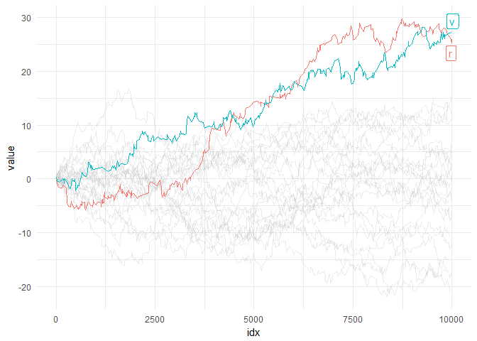
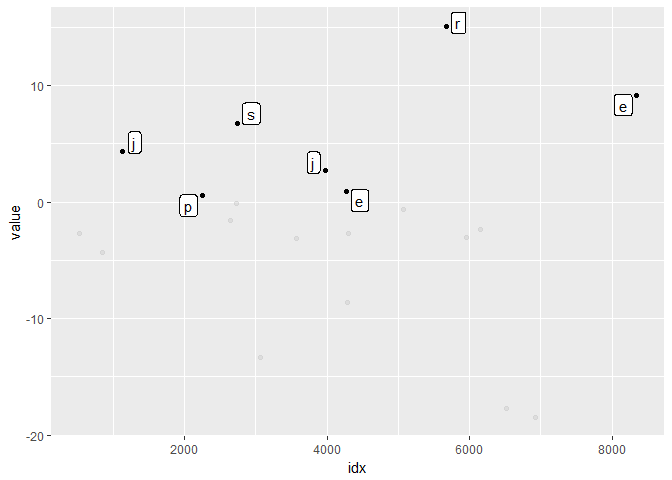

<!-- README.md is generated from README.Rmd. Please edit that file -->
[](https://travis-ci.org/yutannihilation/gghighlight)

gghighlight
===========

Highlight points and lines in ggplot2.

Installation
------------

You can install gghighlight from github with:

``` r
# install.packages("devtools")
devtools::install_github("yutannihilation/gghighlight")
```

Example
-------

Suppose the data has a lot of series.

``` r
library(tidyverse)

set.seed(1)
d <- tibble(
  idx = 1:10000,
  value = runif(idx, -1, 1),
  type = sample(letters, size = length(idx), replace = TRUE)
) %>%
  group_by(type) %>%
  mutate(value = cumsum(value)) %>%
  ungroup()
```

It is difficult to distinguish them by colour.

``` r
ggplot(d) +
  geom_line(aes(idx, value, colour = type))
```


So we are motivated to highlight only important series, like this:

``` r
library(gghighlight)

gghighlight_line(d, aes(idx, value, colour = type), max(value) > 20)
```


As `gghighlight_*()` returns a ggplot object, it is customizable just as we usually do with ggplot2.

``` r
gghighlight_line(d, aes(idx, value, colour = type), max(value) > 20) +
  theme_minimal()
```



``` r
set.seed(10)
d2 <- sample_n(d, 20)

gghighlight_point(d2, aes(idx, value), value > 0)
#> Warning in gghighlight_point(d2, aes(idx, value), value > 0): Using type as
#> label for now, but please provide the proper label_key...
```


