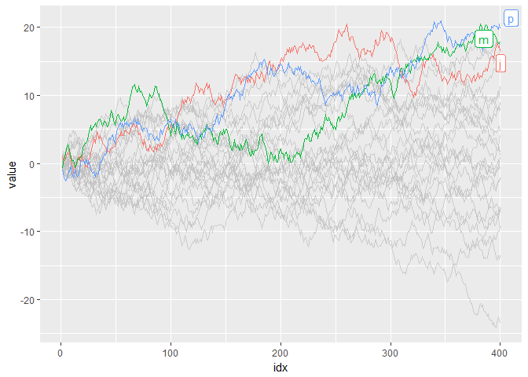
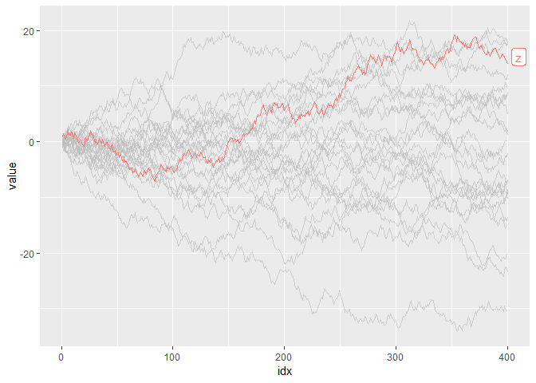
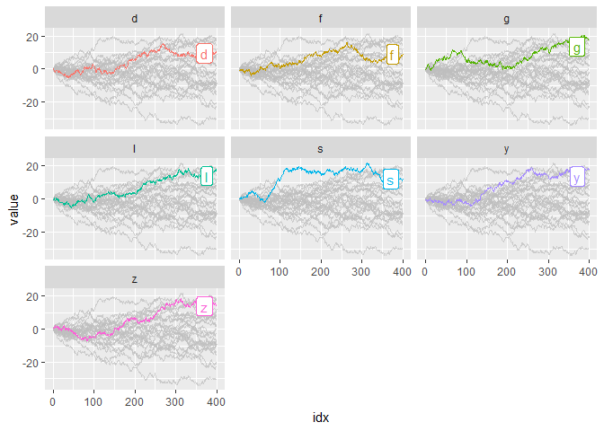
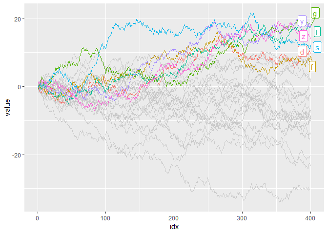
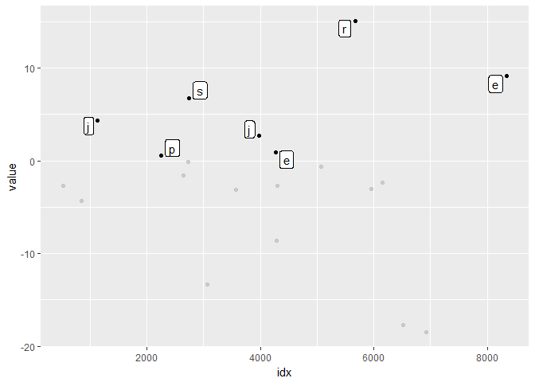
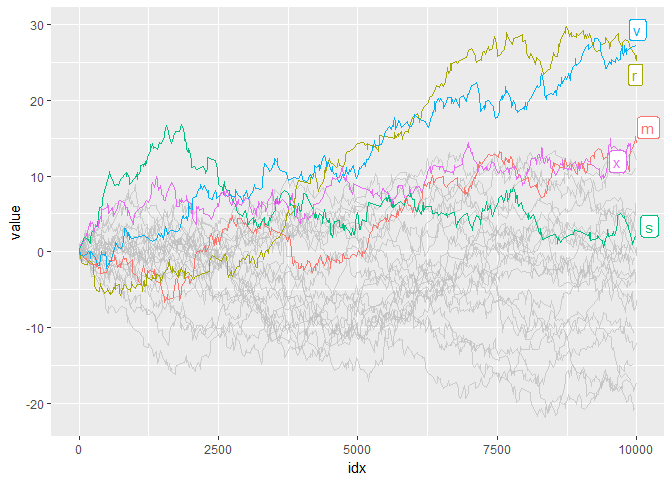

<!-- README.md is generated from README.Rmd. Please edit that file -->
gghighlight
===========

[](https://travis-ci.org/yutannihilation/gghighlight) [](https://cran.r-project.org/package=gghighlight)

Highlight geoms in ggplot2.

Installation
------------

``` r
install.packages("gghighlight")

# Or the development version from GitHub:
# install.packages("devtools")
devtools::install_github("yutannihilation/gghighlight")
```

Example
-------

Suppose the data has a lot of series.

``` r
set.seed(2)
d <- purrr::map_dfr(
  letters,
  ~ data.frame(idx = 1:400,
               value = cumsum(runif(400, -1, 1)),
               type = .,
               flag = sample(c(TRUE, FALSE), size = 400, replace = TRUE),
               stringsAsFactors = FALSE))
```

It is difficult to distinguish them by colour.

``` r
library(ggplot2)

ggplot(d) +
  geom_line(aes(idx, value, colour = type))
```


So we are motivated to highlight only important series, like this:

``` r
library(gghighlight)

ggplot(d) +
  geom_line(aes(idx, value, colour = type)) +
  gghighlight(max(value) > 15)
#> label_key: type
```



If you want fewer highlighted lines, you can add multiple predicates.

``` r
ggplot(d) +
  geom_line(aes(idx, value, colour = type)) +
  gghighlight(max(value) > 15, mean(flag) > 0.55)
#> label_key: type
```



As adding `gghighlight()` results in a ggplot object, it is customizable just as we usually do with ggplot2.

``` r
ggplot(d) +
  geom_line(aes(idx, value, colour = type)) +
  gghighlight(max(value) > 15) +
  theme_minimal()
#> label_key: type
```


The plot also can be facetted:

``` r
ggplot(d) +
  geom_line(aes(idx, value, colour = type)) +
  gghighlight(max(value) > 15) +
  facet_wrap(~ type)
#> label_key: type
```



### Examples

`gghighlight()` can highlights almost any geoms. Here's some examples:

#### Line

``` r
library(gghighlight)

ggplot(d) +
  geom_line(aes(idx, value, colour = type)) +
  gghighlight(max(value) > 15)
#> label_key: type
```



#### Point

``` r
set.seed(10)
d2 <- dplyr::sample_n(d, 20)

ggplot(d2, aes(idx, value)) +
  geom_point() +
  gghighlight(value > 0, label_key = type)
```



### Grouped vs ungrouped

(TBD)

#### Non-logical predicate

To construct a predicate expression like bellow, we need to determine a threshold (in this example, `20`). But it is difficult to choose a nice one before we draw plots.

``` r
max(value) > 20
```

So, `gghighlight()` allows predicates that return numeric (or character) results. The values are used for sorting data and the top `max_highlight` of rows/groups are highlighted:

``` r
ggplot(d, aes(idx, value, colour = type)) +
  geom_line() +
  gghighlight(max(value), max_highlight = 5L)
#> label_key: type
```


