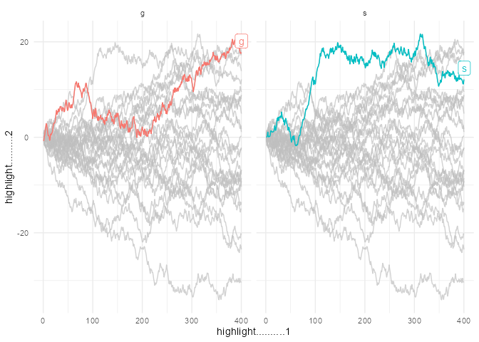

<!-- README.md is generated from README.Rmd. Please edit that file -->

# gghighlight

<!-- badges: start -->

[](https://github.com/yutannihilation/gghighlight/actions)
[](https://cran.r-project.org/package=gghighlight)
<!-- badges: end -->

Highlight geoms in ggplot2.

## Installation

``` r
install.packages("gghighlight")

# Or the development version from GitHub:
# install.packages("devtools")
devtools::install_github("yutannihilation/gghighlight")
```

## Example

Suppose we have a data that has so many series that it is hard to
identify them by their colours as the differences are so subtle.

``` r
library(ggplot2)

ggplot(d) +
  geom_line(aes(idx, value, colour = type))
```

<!-- -->

With `gghighlight()`, we can highlight the lines whose max values are
larger than 20:

``` r
library(gghighlight)

p <- ggplot(d) +
  geom_line(aes(idx, value, colour = type)) +
  gghighlight(max(value) > 19)
#> label_key: type

p
```

<!-- -->

The result is a usual ggplot object, so it is fully customizable. For
example, it can be used with custom themes and facets.

``` r
p + theme_minimal()
```

<!-- -->

``` r
p + theme_minimal() + facet_wrap(~ type)
```

<!-- -->

`gghighlight()` can highlight almost any geoms. For more details, please
read [Introduction to
gghighlight](https://yutannihilation.github.io/gghighlight/articles/gghighlight.html).
